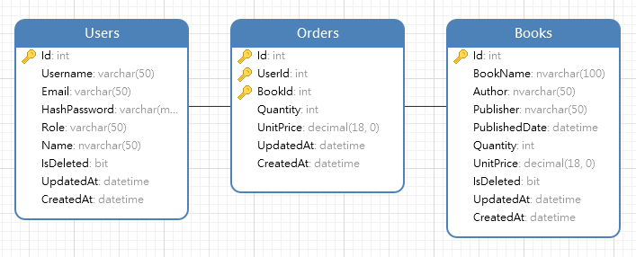

# bookstore API
>## Introduction
- This is simple API for register user, manage books, order books.

>## Technology & 
- **Core:** ASP.NET Core 3.1
- **Architecture:** MVC + 3-Layer
- **Design pattern:** Repository Pattern
- **ORM:** Dapper (Dapper.Repositories package)
- **OAuth:** JsonWebToken
- **Logger:** Serilog
- **API Documentation:** NSwag (Swagger), Postman documentation

>## How to install
### 1. Setup database
1. Open Microsoft SQL Server Management Studio 18
2. Create new database with name `bookstore`
3. Open script `database.sql` and run to create tables
4. Open script `seeddata.sql` and run to create seed data

### 2. Config `appsettings.json`
- Open `appsettings.json` and update your connection string in section `DefaultConnection`

### 3. Open `bookstore.sln` and build project

>## API Documentation
- https://documenter.getpostman.com/view/11144072/TVCgzSoB

>## Database schema
